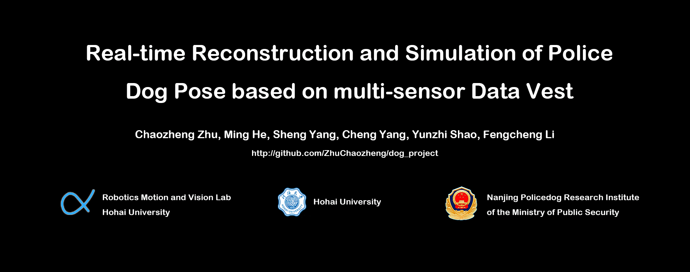
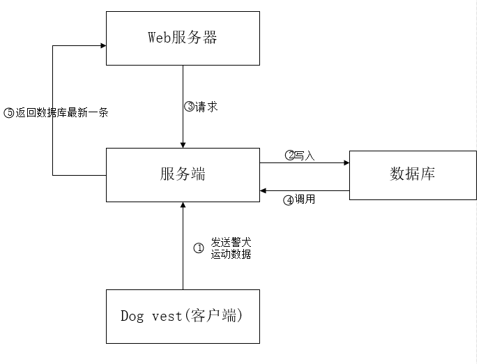
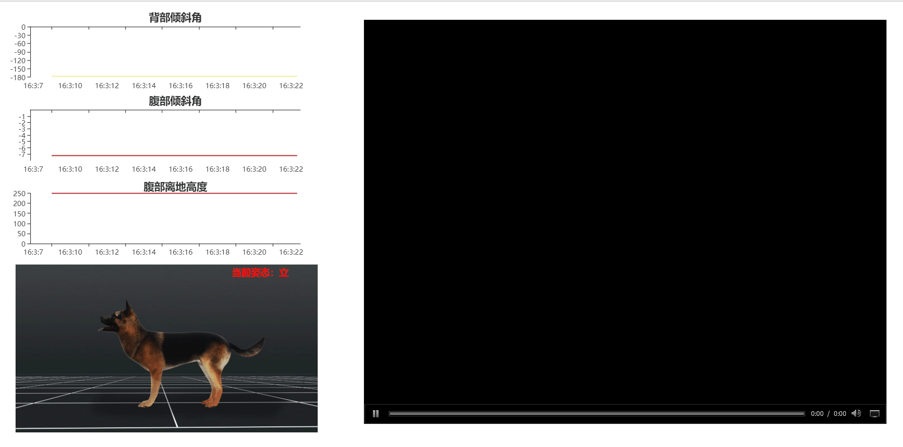

# dog_project

[README](README.md) | [中文文档](README_zh.md)

The full name of this project is called Real-time reconstruction and simulation of Police dog pose based on multi-sensor data vest. It has the characteristics of comfortable to wear, excellent real-time, high reliability, high precision,and supporting 4G network. When the 4G network environment is stable, the delay of the system is less than 1s. The system is based on the multi-sensor network to detect and reconstruct the dog's pose, which can reflect the dog's current pose information in the real-time and high precision. For the anti-terrorism investigation and explosion, it can further reduce the risks of tasks by using the dog's mobility.

Contents
========

* [Video](#jump_1)

* [Environment](#jump_2)

* [System architecture](#jump_3)

* [Clone project](#jump_4)

* [Build system](#jump_5)

* [System display](#jump_6)

* [Roadmap](#jump_7)

* [Attention](#jump_8)

* [Appendix](#jump_9)

# Video

Environment
===========

>Hardware: a raspberry pi 3B +, two IMU sensors, a mobile power, a police dog vest

>Software: Ubuntu system, Nginx server, lighttpd server, python3

System Architecture
===================

There are camera and IMU sensors in the data vest which can conveniently collect video from the fpv (first person vision) and acceleration, angular velocity of the dog body. Raspberry(client) then as a middleware sends the collected dog's data of pose and video to the remote server (specifically, our domain:server.blackant.org). Nginx server is used for playing RTMP video stream, and lighttpd server simultaneously analyses the trust pose based on the trained knowledges and displays the dog's pose and data on popular browser (Firefox,Safari and etc.).

Clone project
=============

``git clone https://github.com/ZhuChaozheng/dog_project.git``

Build system
============

 server
-------

**(1) get into folder and move back end and web services to /var/www/html**

``cd dog_project && mv /html/ /var/www/html``

**(2) build nginx server and lighttpd server, provide video and web services respectively**

download nginx

``sudo apt-get install nginx``

get into project folder,mv nginx.confto /etc/nginx/

``mv ./nginx.conf /etc/nginx``

run nginx server

``sudo /etc/init.d/nginx start``

download lighttpd

``apt-get install lighttpd``

run lighttpd

``./lighttpd -f ../config/lighttpd.conf``

 client（raspberry）
--------------------

run client file

``python3 dogs_client_raspberry.py``

run run_video.sh, streaming video

`./ run_video.sh`

System display
=======

Roadmap
=======

*Waiting…*

Attention
=========

1.  The browser should turn on the flash plug-in to see the video stream

2.  The ID and password of the data gateway we used are as follows:

>   ssid=HUAWEI-5F42

>   psk=34127615

Of course, you can also modify the configuration of network if you are familiar
with the command of Linux:

`sudo vi /etc/wpa_supplicant/wpa_supplicant.conf`

Appendix
========

Our system image of Raspberry is in the care of BaiduNetdisk.

>Link: https://pan.baidu.com/s/1mKjUmRVHnB2NxapOAziL0A

>Extraction code: rrdn
